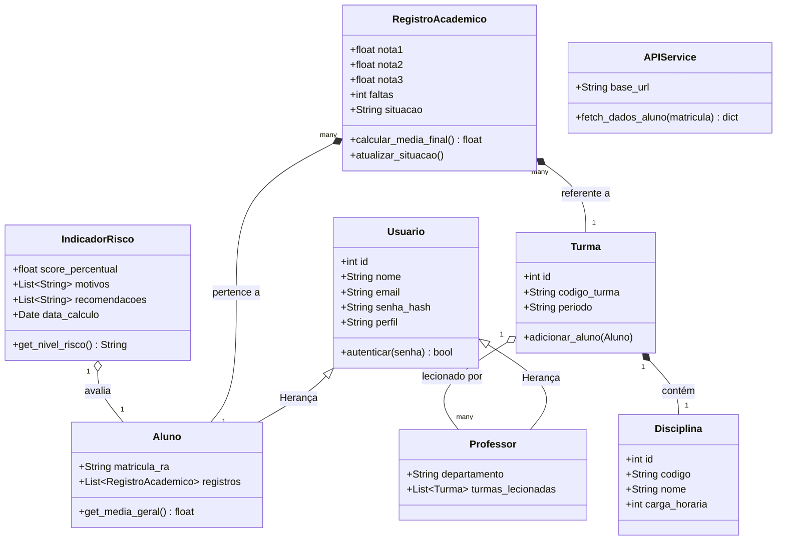

# Modelagem UML - SIMPA

Este documento apresenta os diagramas conceituais estruturados durante a Semana 3 do Ciclo 1.
Eles podem ser visualizados em qualquer renderizador Mermaid (como o próprio visualizador nativo do GitHub).

## 1. Diagrama de Casos de Uso

```mermaid
usecaseDiagram
    actor "Administrador (Coordenação)" as Admin
    actor "Sistema AVA (Moodle)" as Moodle
    
    package "SIMPA - Sistema Inteligente de Monitoramento" {
        usecase "Fazer Login" as UC1
        usecase "Sincronizar Dados do AVA" as UC2
        usecase "Visualizar Painel de Indicadores" as UC3
        usecase "Gerenciar Alunos (CRUD)" as UC4
        usecase "Gerenciar Matrículas" as UC5
        usecase "Consultar Análise de Risco" as UC6
    }
    
    Admin --> UC1
    Admin --> UC3
    Admin --> UC4
    Admin --> UC5
    Admin --> UC6
    
    UC1 ..> UC2 : <<extend>> (Login via Moodle)
    UC2 <-- Moodle : Fornece notas e cursos
    UC6 ..> UC3 : <<include>>
```

## 2. Diagrama de Classes (Domínio)

Este diagrama reflete as classes implementadas no arquivo `app/models.py` (Semana 4).


